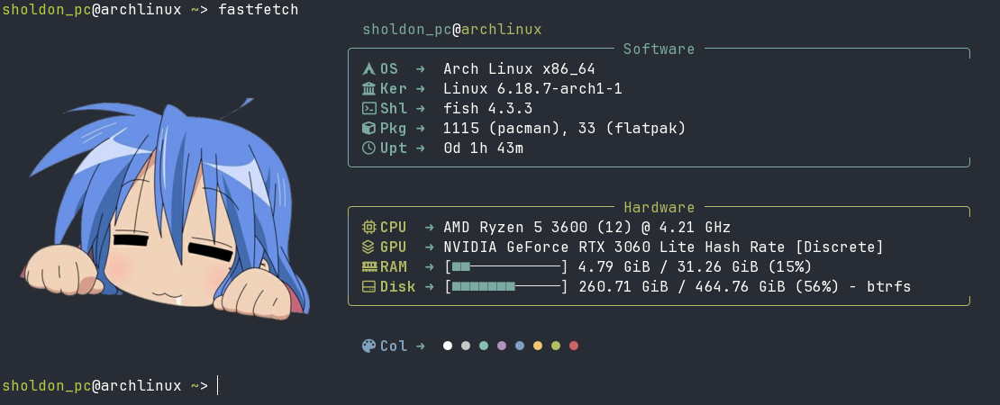

## Preview
First one was made on my laptop


Second one was made on my main pc


## Requirements
* **Terminal:** Kitty (or Ghostty)
* **Font:** JetBrainsMono Nerd Font (for icons)
## Installation

**If you already had a config, delete it by this command:**
```bash
rm -rf ~/.config/fastfetch
```
**Then install by this command**
```bash
git clone https://github.com/KeYnU/fastfetch-config.git && mkdir -p ~/.config/fastfetch && cp fastfetch-config/config.jsonc ~/.config/fastfetch/config.jsonc && cp fastfetch-config/*.png ~/.config/fastfetch/
