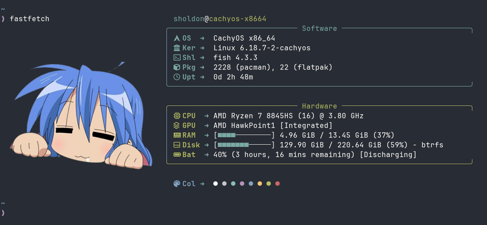

# Fastfetch Config

Clean and stylish fastfetch configuration.

## Preview


## Requirements
* **Terminal:** [Kitty] (for image support)
* **Font:** [JetBrainsMono Nerd Font] (to display icons correctly)

## Installation

**Clone to your config directory:**

```bash
mkdir -p ~/.config/fastfetch
git clone https://github.com/KeYnU/fastfetch-config ~/.config/fastfetch
